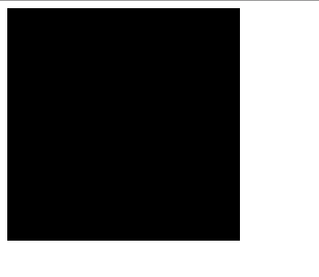

#Getting started with PixiJS
## 설치

### npm install
```
$ npm install pixi.js
```

### git clone
```
$ git clone git@github.com:pixijs/pixi.js.git
```

### bower install
```
$ bower install pixi.js
```

### CDN install
```xml
<script src="https://cdnjs.cloudflare.com/ajax/libs/pixi.js/4.2.2/pixi.min.js"></script>
```

- pixi 원문 : [https://github.com/pixijs/pixi.js](https://github.com/pixijs/pixi.js)


## renderer 와 stage 를 만들기
당신은 지금 바로 pix 를 사용할 수 있다.

하지만 어떻게?

첫번째 단계는 이미지를 표시 할 수 있는 직사각형 영역을 만드는 것이다. Pixi 의 `renderer` 객체를 이용해서 만들 수 있다. HTML `<canvas>` 엘리먼트를 자동으로 생성하고 이미지를 canvas 에 표시하는 방법을 알아본다. 다음으로 `stage` 라는 특별한 Pixi 컨테이너 객체를 호출 한다. 앞으로 알아보겠지만, 이 `stage` 객체는 Pixi 가 표시하고자 하는 모든 것의 루트 컨테이너 이다.

`renderer`와 `stage` 를 만들기 위한 코드는 다음과 같다. `<script>` 태그 사이에 코드를 HTML 문서에 추가 하시오.

```js
// renderer 를 만든다.
var renderer = PIXI.autoDetectRenderer(256, 256);

//HTML 문서에 canvas 를 추가 한다.
document.body.appendChild(renderer.view);

// container 객체를 호출하여 `stage` 를 생성한다.
var stage = new PIXI.Container();

//Tell the `renderer` to `render` the `stage`
// `renderer` 를 이용해 `stage` 를 `render` 하도록 한다.
renderer.render(stage);
```

이것이 Pixi 를 사용하기 위한 가장 기본적인 코드이다. 가로 세로 256px 의 검은색 canvas 엘리먼트를 생성하고 HTML 문서에 추가하였다. 코드를 실행하면 브라우저에서 아래와 같은 화면을 볼 수 있다.



예, [검은색 사각형](Yay, a black square!) ~~뭐... 별로 감흥은 없지만.. 원문에 충실하기 위해~~

Pixi `autoDetectRenderer` 메서드는 사용 가능한 버전에 따라 Canvas Drawing API 와 WebGL 중 어떤것을 사용하여 그래픽을 렌더링 힐지를 결정한다. 첫번째와 두번째 인자는 canvas 의 `width` , `height` 이다. 세번째 인자는 옵션이며, 추가값을 설정 할 수 있다. 이 세번째 인자는 object literal( 객체 리터럴 )이고, anti-aliasing( 안티얼리어싱 / 포토샵의 그것 / [위키](https://namu.wiki/w/%EC%95%88%ED%8B%B0%EC%97%90%EC%9D%BC%EB%A6%AC%EC%96%B4%EC%8B%B1) ), transparency (투명도) 그리고 resolution(해상도) 을 지정할 수 있다.

```js
renderer = PIXI.autoDetectRenderer(
  256, 256,
  {antialias: false, transparent: false, resolution: 1}
);
```

이 세번째 인자는 옵션이다. - 만약 마음에 들지 않는다면 기본 설정을 변경할 수 있다. 하지만 일반적인 상황에서 변경할 필요는 없다. ( 필요한 경우 Pixi 의 [canvas Renderer](http://pixijs.download/release/docs/PIXI.CanvasRenderer.html) 그리고 [WebGLRenderer](http://pixijs.download/release/docs/PIXI.WebGLRenderer.html) 안내문을 참고 하시오. )

**그 옵션들은 무엇을 하는가?** ( ~~위에 써놨으면서..~~ )
```js
{antialias: false, transparent: false, resolution: 1}
```
`antialias` 는 font 나 그래픽 요소의 가장자리를 부드럽게 한다. ( 모든 플랫폼에서 WebGL anti-aliasing 을 지원지 않으므로, 당신이 만들고 있는 플랫폼(게임)에서 테스트가 필요하다. )
`transparent` 는 canvas 의 배경을 투병하게 할 수 있다.
`resolution` 을 사용하면 쉽게 화면의 pxiel 밀도를 변경하여 작업할 수 있다. resolution 셋팅 방법은 튜토리얼 범위를 벗어나므로, 세부사항에 대해 확인하고자 한다면 [Mat Grove's Explanation](http://www.goodboydigital.com/pixi-js-v2-fastest-2d-webgl-renderer/)에서 해상도를 사용하는 방법에 대한 세부사항을 참조할것. 대부분의 프로젝트에서는 resolution 을 1로 유지하면 문제가 되지 않는다.

( Note: renderer 에게 네번째의 추가 옵션인 `preserveDrawingBuffer` 를 추가 할 수 있으며, 기본값은 `false` 이다. `dataToURL` 메서드를 호출해야 하는 경우에만 `true` 를 설정한다. )

Pixi 의 renderer 는 기본적으로  WebGL 을 사용하도록 되어 있다. WebGL 은 매우 빠르며, 앞으로 알게될 멋진 효과들을 사용할 수 있다. 하지만 Canvas Drawing API 를 사용해야 한다면 아래와 같이 사용하면 된다.

```js
renderer = new PIXI.CanvasRenderer( 256, 256 );
```

첫번째와 두번째 인자가 필요하며, 각각 `width` 그리고 `height` 이다.

강제로 WebGL rendering 만을 사용하는 방법은 아래와 같다.
```js
renderer = new PIXI.WebGLRenderer( 256, 256 );
```

`renderer.view` 객체는 평범한 `<canvas>` 객체이다. 이것은 일반적인 canvas 객체를 제어하는 방법과 같다. canvas 의 dashed border 를 추가하는 방법을 알아보자.

```js
renderer.view.style.border = "1px solid black";
```

만약 canvas 가 만들어진 이후에 배경색을 바꾸고 싶다면, `renderer` 객체의 `backgroundColor` 프로퍼티를 16진수 컬러로 지정하면 된다.
```js
renderer.backgroundColor = 0x061369;
```
만약 `renderer` 의 width 혹은 height 값이 알고 싶다면, `renderer.view.width` 그리고 `renderer.view.height` 를 사용할것.

( 중요 : `stage` 의 `width`, `height` 속성이 있지만, rendering window 는 그것을 참조하지 않는다.~~같지 않다고...쓰면되지 어렵게도 써놨음.~~ `stage` 의 `width` 와 `height` 는 그 안에 추가한 것들이 차지하는 영역만을 알려준다. )

canvas 의 사이즈를 변경하려면, `renderer` 의 `resize` 메서드를 사용하고, 새로운 `width`, `height` 값을 지정한다. 그러나, 해상도와 일치하는 canvas 의 사이즈를 지정하려면 `autoResize` 로 지정해야 한다.

```js
renderer.autoResize = true;
renderer.resize( 512, 512 );
```

만약 창에 canvas 를 가득 채우고 싶다면, CSS styleing 을 지정하고, 브라우저 창의 크기를 renderer 에 대입한다.
```js
renderer.view.style.position = "absolute";
renderer.view.style.display = "block";
renderer.autoResize = true;
renderer.resize( window.innerWidth, window.innerHeight );
```

HTML element 의 css 기본 padding , margin 속성을 0 으로 해 주어야 한다. 
```xml
<style>
*{margin: 0; padding: 0;}
</style>
```
( 참고. 별표, *, 는 CSS 의 'universal selector' 이며, html 문서의 모든 태그를 의미한다. )
만약 브라우저 창의 크기에 비례하여 canvas 의 사이즈를 변경하고 싶다면, 사용저 정의 함수인 [scaleToWindow](https://github.com/kittykatattack/scaleToWindow) 를 사용할것.
```
**참고1**
- 요즘 이것 말고 초기화에 대한 여러가지 방법론 등이 나와있으나 일단 pixijs 에 충실하기 위해 패스.. )
- `*` 선택자를 사용하여 style 을 추가하면 html 에 추가되는 모든 엘리먼트에 style 을 overwrite 한다. 따라서 별로 좋은 방법은 아니다.
**참고2**
- 아니, 브라우저 가로 세로 비율에 맞게 canvas 태그 가로 세로 값 변경하는거 그닥 어려운것도 아닌데... 뭐....여튼 만들어 놓은 사람 성의가 있으니 가져다 쓸 사람을 자져다 쓰자...
```


##Pixi sprites
이전 섹션에서 다음과 같이 `stage` 객체를 생성하는 방법에 대해 알아 보았다.

```js
var stage = new PIXI.Container();
```
stage 는 Pixi 컨테이너 객체이다. 
